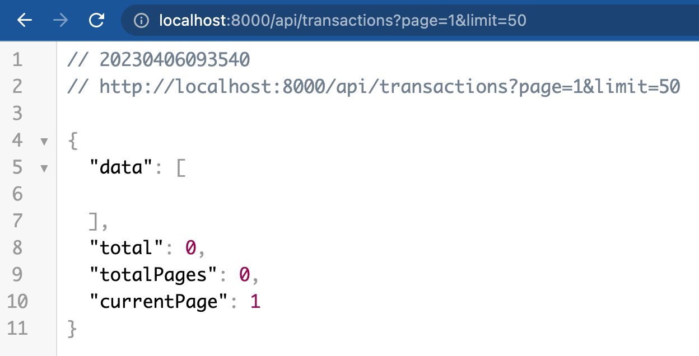

### MESSAGE QUEUE PROJECT

### How to run this app

### 1. Locally

- Pull the repo
- insert the .env file, see `.sample_env`
- Run `yarn install`
- start your rabbitmq server locally or using docker

```text
docker run -d --hostname rabbitmq --name rabbitmq -p 5672:5672 rabbitmq:3
```

- start your `msql` server
- Run the app
  
```text
yarn dev
```

### 2. Using Docker-Compose (recommended)

- start docker
- Run the app by using the make file
  
```text
compose-compose up
```




check the API Documentation here

https://documenter.getpostman.com/view/23440141/2s93RXrq2w